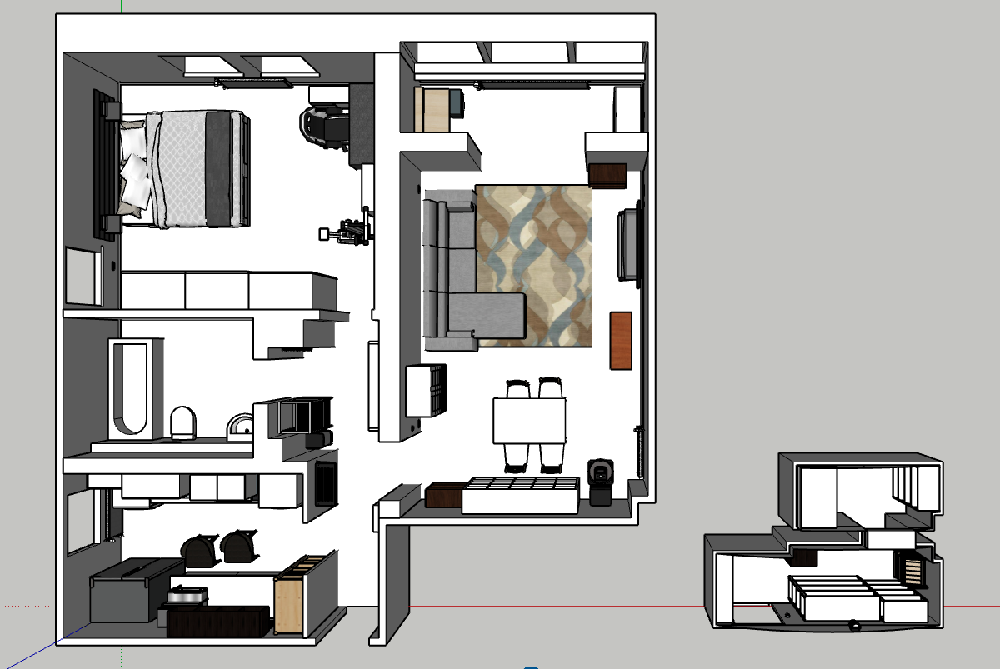
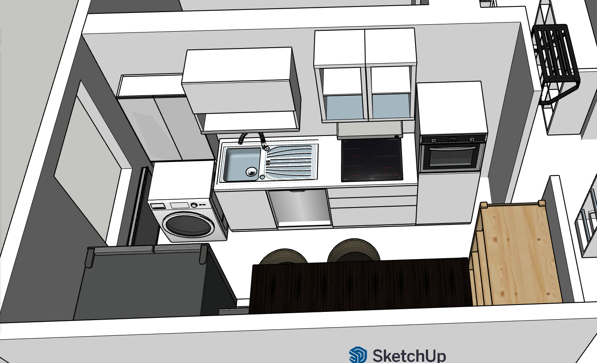
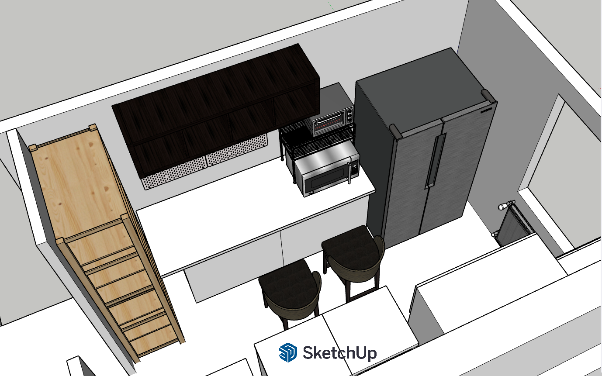
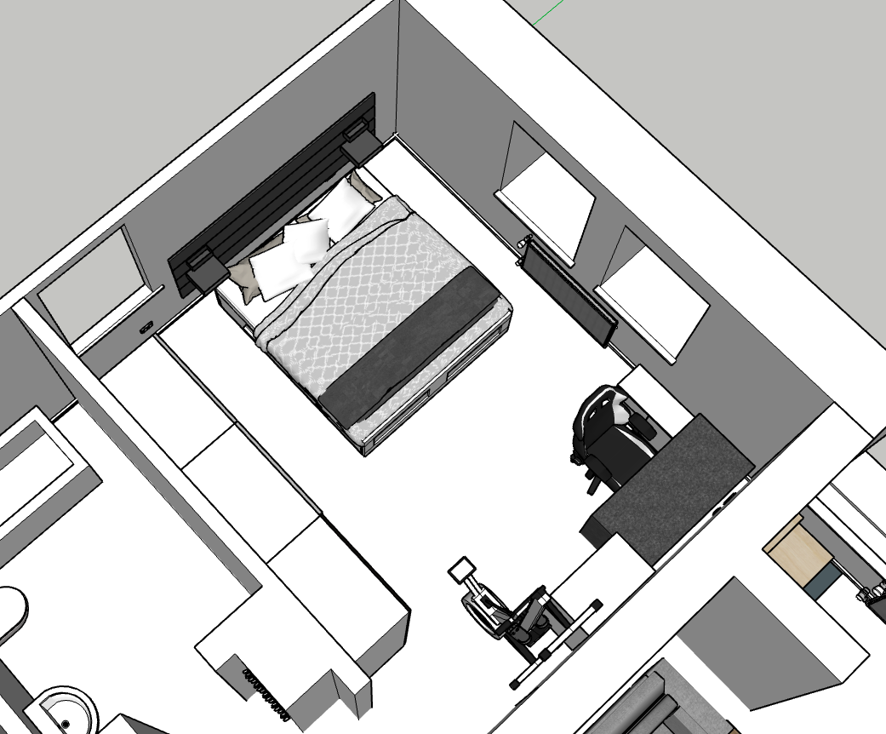
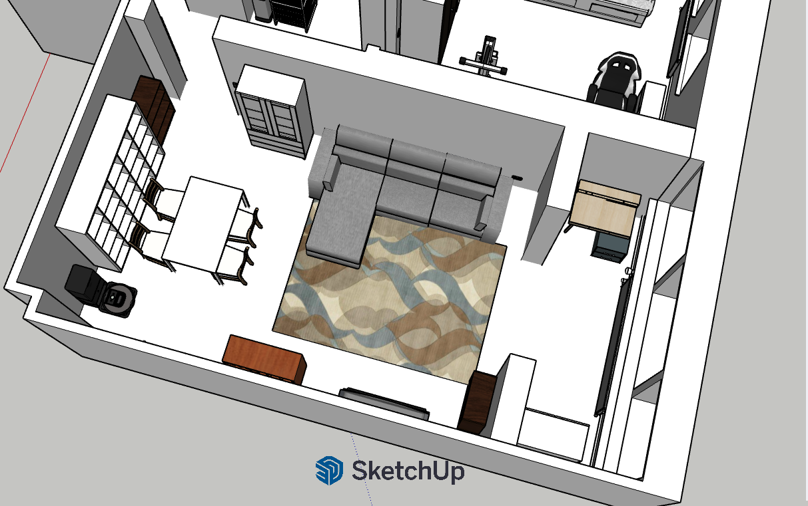
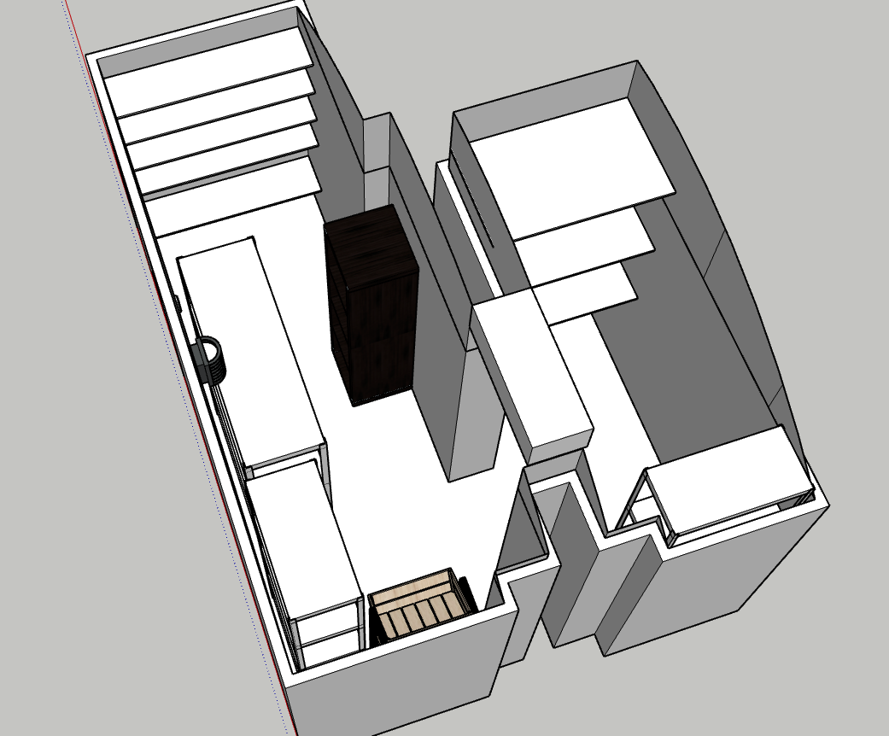

# 3D Relocation Planning with SketchUp

A self-directed project using 3D modeling to plan an apartment move end to end, verifying furniture fit before moving day and giving the moving crew clear visual placement instructions, since I could not be in every room at the same time to direct placement verbally.

## The Problem

This was a downsizing move into a significantly smaller apartment on a higher floor. Not everything could come along, and every placement decision had ripple effects. Movers who have never seen the flat need to know where every piece goes, finding out on moving day that a wardrobe does not fit its intended wall is expensive, and hauling furniture upstairs only to discover it has no home is worse. Before a single box was packed, I wanted to know what would fit, where everything would go, and what needed to be sold or given away in advance.

## Approach

SketchUp was new to me and self-taught for this project. Prior parametric CAD experience (CATIA, from my aerospace engineering degree) meant the concepts transferred, but the toolset did not.
 
- **Modeled the apartment to real dimensions.** The entire model is built in centimeters from my own measurements of the floor plan, including walls, doors, windows, radiators, and pipework.
- **Sourced furniture smartly instead of rebuilding it.** Around 80 components, many of them real catalog items (IKEA KALLAX, MALM, PAX, BISSA, VANGSTA and others), mostly pulled from SketchUp's 3D Warehouse and verified against published manufacturer dimensions before trusting them for fit checks; pieces not available there were modeled from my own measurements.
- **Validated constraints before the move.** Wardrobe clearances, door swings, appliance niches, and shelf runs were all tested virtually. Items that did not fit their intended spot were replanned in the model, not on moving day.
- **Made keep-or-sell decisions with data, not guesswork.** Because the new layout was fully modeled, furniture that had no viable place was identified ahead of the move and sold or given away in advance, instead of being discovered as surplus on moving day or, worse, after the move, leaving me to carry it back down the stairs myself.
- **Produced execution guides for the movers.** Saved scenes provide a room-by-room visual walkthrough (kitchen, living area, bathroom, bedroom, basement storage), plus a dedicated print view handed to the crew on moving day.
- **Planned the basement storage separately.** Shelving layout and box placement were modeled in advance so storage capacity was known, not guessed.

## Scenes

| Scene | View |
|---|---|
| Kitchen view 1 |  |
| Kitchen view 2 |  |
| Bedroom |  |
| Living area |  |
| Basement storage plan |  |

## Outcome

The planning held. Every keep-or-sell decision made in the model proved correct. Nothing was carried upstairs without a place waiting for it, and nothing that was kept failed to fit. Surplus furniture was sold or given away before the move rather than being discovered on the day, and the room-by-room guides meant placement questions were answered by referring to a printout instead of deciding under pressure. The move was completed with every item in its planned place at the end.

## Why This Is on My Portfolio

My background is a decade of program management in safety-critical automotive systems, and this project is the same discipline applied to an everyday problem. Requirements were captured through physical measurement, feasibility was verified against real constraints before committing, scope decisions (keep, sell, replace) were made early with data, changes were handled in the model rather than during execution, and the execution team was handed visual documentation that leaves no room for interpretation. It is here as evidence that I pick up new software quickly when a problem calls for it, and that I plan and communicate clearly enough that when moving day brings surprises, adapting is a choice rather than a scramble.

## Technical Notes

- Built in SketchUp (desktop and web clients)
- Units: centimeters, all geometry from physical measurements
- ~80 named components, ~170 materials
- 11 saved scenes plus a print layout for the moving crew
- IFC 2x3 classification schema included in the model

## Files

The original `.skp` file is not included in this repository (proprietary binary format, not viewable on GitHub). All renders in `/images` are exported from the full-resolution model. A simplified [apartment-model.stl](apartment-model.stl) (decimated from 715k to 150k faces for fast loading) is included for interactive 3D preview directly in GitHub.